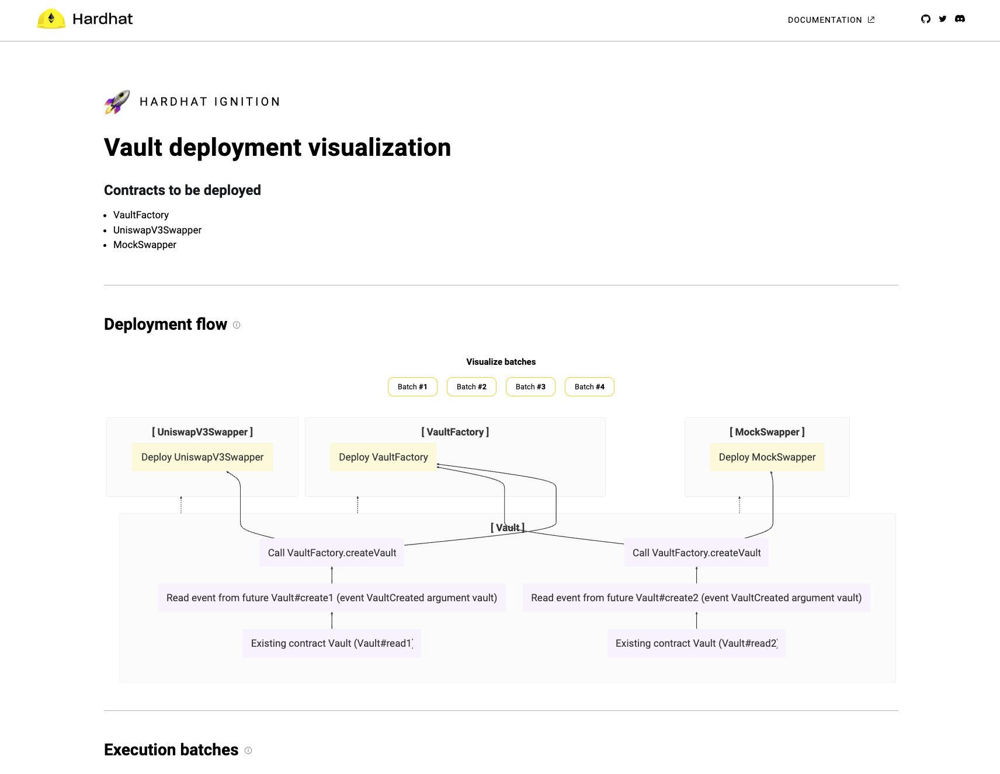

# hardhat ignition demo

This is a demo of the [Hardhat Ignition](https://hardhat.org/ignition/docs/getting-started#overview), a tool that allows you to easily deploy and interact with smart contracts in a declarative way.

## Prerequisites

- [hardhat](https://hardhat.org/hardhat-runner/docs/getting-started#installation)
- [hardhat-ignition](https://hardhat.org/ignition/docs/getting-started#installation)

## Install dependencies

```bash
npm install
```

## Deploy to local node

### Deploy vaults

```bash
make localnode
make deploy/vaults/localhost:
```

### See the result

```bash
make visualize
```

deployed contract addresses are saved in `ignition/deployments/{chain_name}/deployed_addresses.json` file.

this will open a browser window with the visualization of the deployed contracts.



## Deploy to Sepolia testnet

### Setup env file

```bash
cp .env.example .env
```

then fill in the `SEPOLIA_RPC_URL` and `PRIVATE_KEY` variables.

[!WARNING]: do not commit the `.env` file to the repository, it would results to get your account drained.

### Deploy vaults

```bash
make deploy/vaults/sepolia
```

### See the result

```bash
make visualize
```
